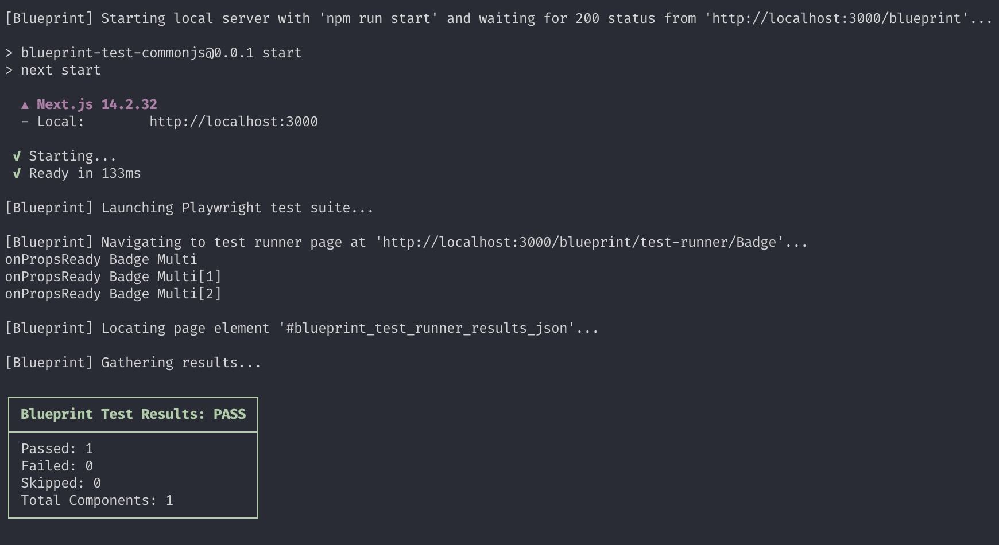
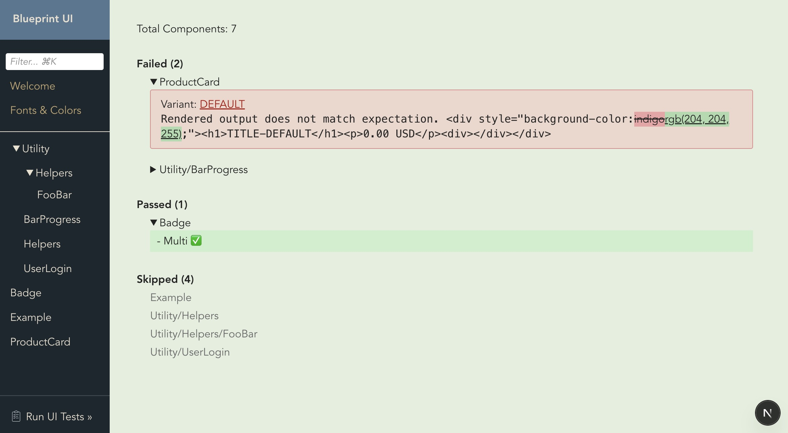
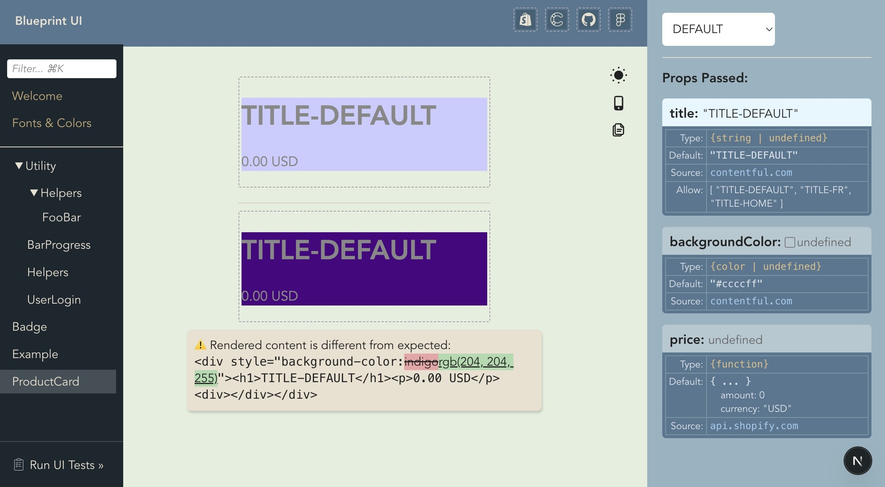

# How to run Blueprint Tests

Blueprint Tests ensure that when the component renders, it matches the expectation that was defined in the component's blueprint. These tests can be run through CI or using the UI interface.

## Getting Started

### 1) Follow the basic instructions to install [blueprint-design-kit](https://github.com/blueprint-design-kit/blueprint-design-kit)

The simplest install is copied here for easy reference...

```bash
npm install blueprint-design-kit
```

Add blueprint to your build scripts
```json
{
	"scripts": {
        "dev": "blueprint dev & next dev",
		"build": "blueprint build && next build",
        "start": "next start",
        "test": "blueprint test --serverCommand='npm run start'",
	}
}
```
Create a .blueprint.tsx file next to one of your components

IMPORTANT: Be sure to add the expected output onto each variant (accepts JSX).
```tsx
// app/components/ProductCard.blueprint.tsx
import { Blueprint } from 'blueprint-design-kit';

const ProductCardBlueprint = new Blueprint({
	schema: {
		title: {
			type: ['string', 'undefined'],
			default: 'Test Product',
			allow: ['Test Product', 'Necklace', 'Purse'],
		},
	},
	variants: {
		Necklace: {
			props: { title: 'Necklace' },
            expected: <div>
                <h1>Necklace</h1>
                <p>18K Gold</p>
            </div>,
		},
        NotValid: {
			props: { title: 'Bad Product' },
            expected: null,
		},
	},
});

export default ProductCardBlueprint;
```

### 2) Run your tests from command line

```
$ npm run build
$ npm run test
```


### 3) Run your tests from the UI Interface

Start your application
```
$ npm run dev
```

Then do the following
1. Click on `Run UI Tests »` in the bottom left of the screen
2. Click on the big button to `Test all expectations »`
3. Wait for the results



To debug a specific failing component, it is usually easiest to click on the name of the variant in the results report to navigate to the component preview (or just use the Component Menu on the left). On this screen, you will be able to see the two different outputs side by side and a warning message explaining the issue. Simply save changes in your component or your blueprint and watch them update in realtime.


