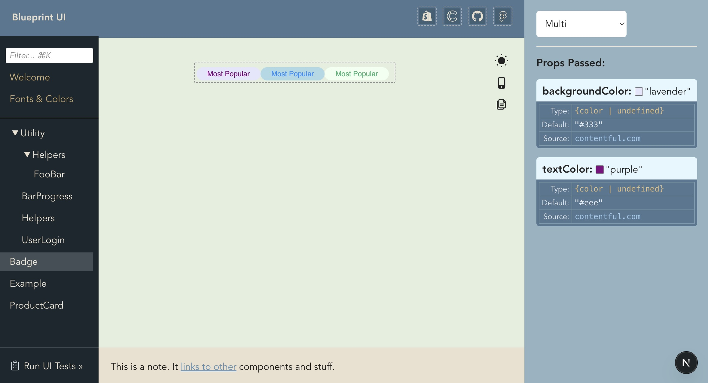

# How to Use Blueprint Design Kit UI

This is a premade Blueprint UI for showcasing, testing, and documenting components. It's ready to drop in and use right away, or you have the option to import the layout components individually to customize your own layout.



## Getting Started

### 1) Follow the basic instructions to install [blueprint-design-kit](https://github.com/blueprint-design-kit/blueprint-design-kit)

The simplest install is copied here for easy reference...

```bash
npm install blueprint-design-kit
```

Add blueprint to your build scripts
```json
{
	"scripts": {
		"dev": "blueprint dev & next dev",
		"build": "blueprint build && next build",
	}
}
```
Create a .blueprint.tsx file next to one of your components
```tsx
// app/components/ProductCard.blueprint.tsx
import { Blueprint } from 'blueprint-design-kit';

const ProductCardBlueprint = new Blueprint({
	schema: {
		title: {
			type: ['string', 'undefined'],
			default: 'Test Product',
			allow: ['Test Product', 'Necklace', 'Purse'],
		},
	},
	variants: {
		Necklace: {
			props: { title: 'Necklace' },
            expected: <div>
                <h1>Necklace</h1>
                <p>18K Gold</p>
            </div>,
		},
        NotValid: {
			props: { title: 'Bad Product' },
            expected: null,
		},
	},
});

export default ProductCardBlueprint;
```

### 2) Add Blueprint UI routes
For example, if we want our component library to be viewed at `https://myapp.com/blueprint`

```tsx
// app/blueprint/page.tsx
import Blueprint from './[...component]/page';

export default Blueprint;
```

```tsx
// app/blueprint/[...component]/page.tsx
import BlueprintDesignKitUI from 'blueprint-design-kit/ui';

export default async function Blueprint({ params, searchParams }) {
	const urlParams = await params;
	const urlSearchParams = await searchParams;

    const componentPath = decodeURIComponent((urlParams.component || []).join('/'));
    const locale = decodeURIComponent(urlParams.locale || '');

	const documentation = {
		Welcome: <h1>Hi, welcome to our design system</h1>,
	};

    if (process.env.ENVIRONMENT === 'production') {
        return null;
    }

	return (
		<BlueprintDesignKitUI
			componentPath={componentPath}
            locale={locale}
			activeState={urlSearchParams}
			options={{
				documentation,
				linksMenu: { reversed: true },
			}}
		/>
	);
}
```

### 3) Start your server and open the UI

Execute `npm run dev` then visit your chosen route (`/blueprint`) to browse your library of components.

- Use the dropdown picker at the top right to select different variants for this component when variants are provided.
- Use the icons beside the preview pane to toggle dark mode, device type, etc.
- Use the props explorer to view the props that were passed and update them interactively. (Note: props are only interactive for components marked as 'use client')
- You will see a warning on the page when `⚠️ Rendered content is different from expected`, allowing you to fix issues in realtime.
- *Note: If client components appear stuck as "...loading..." when using the back button on localhost, simply open DevTools > Network and click "Disable cache". This should be a local development issue only.*


### 4) [Optional] Test components against their blueprints using the UI runner

There will be a link at the bottom left called `Run UI Tests »`

This takes you to a launch page where you have the option to "Test all expectations" or to run a subset filtering by component name.

Running tests will quickly iterate through all components and check each variant to ensure that all props are valid and that what is rendered matches what is expected. A report will be generated showing the components that passed, failed, or were skipped because they have no expectations provided.

## Props for &lt;BlueprintDesignKitUI /&gt;

### componentPath:
A string that determines which component is being previewed. This corresponds to the relative path to the component starting from the componentRoot directory.

Typically, in your `page.tsx` file you can pull `await params` and pass the resulting `component` param.

For example: `http://myapp.com/blueprint/Cards/ProductCard` gets passed as `'Cards/ProductCard'`

### locale:
An optional string containing a locale such as `'en-US'` or `'fr'`. If you configure your blueprints to use specific variants per locale, providing this value is how you will be able to preview a specific locale's translation, currency, etc.

Typically, in your `page.tsx` file you can pull `await params` and pass the resulting `locale` param.

For example: `http://myapp.com/en-GB/blueprint/Cards/ProductCard` gets passed as `'en-GB'`

### activeState:
An object containing values that will be used to power what is currently selected/shown in the UI experience:
- **variant** (name of the currently selected variant)
- **device** (name of the currently selected device mode)
- **dark** (determines if we are currently showing dark mode or not)
- **filter** (query string if we are currently filtering the component list)

Typically, in your `page.tsx` file you can pull `await searchParams` and pass the resulting object.

For example: `http://myapp.com/blueprint/Cards/ProductCard?variant=Necklace&device=mobile` gets passed as `{ variant: 'Necklace', device: 'mobile' }`

### options:
Use the following properties on `options: {}` to customize UI behavior...

#### pageTitle
Override the title content that appears at the top left of the UI. Takes any valid ReactNode.
```tsx
{
    pageTitle: <span style={{ fontSize: 20 }}>My Component Library</span>,
}
```

#### baseUrl
Configure the base route to be used when viewing the component library. Defaults to `'/blueprint'`.

For example, to use a custom path with localizations such as `https://myapp.com/de/components/MyComponent` you might set:
```tsx
{
    baseUrl: `${urlParams.locale ? `/${urlParams.locale}` : ''}/components`,
}
```

#### documentation
These documentation pages will appear at the top of your components list. A page takes any valid ReactNode as content.
```tsx
{
    documentation: {
        Welcome: <h1>Welcome to my UI Library</h1>,
        'Colors & Fonts': <h1>List Typography Here</h1>,
    },
}
```

#### componentMenu
```tsx
{
    componentMenu: {
        // Set to false to hide the serarch/filter bar, shown by default
        searchBar: false,
    },
}
```

#### linksMenu
```tsx
{
    linksMenu: {
        // Set to false to reverse link order.
        // Defaults to true for better for right-aligned display.
        reversed: false,
    },
}
```

#### darkMode
```tsx
{
    // Apply a custom className to the render container 
    // 'class="dark"' is applied by default unless overridden here
    darkMode: { customClassName: string },
}
```
```tsx
{
    // Hide the dark mode toggle from the preview controls
    darkMode: false,
}
```

#### deviceMode
```tsx
{
    // Configure device breakpoints and classes
    deviceMode: {
        includeTablet: true; // Adds tablet breakpoint in addition to desktop/mobile
        defaultValue: 'mobile'; // When not set, component preview stretches to fill window
		breakpoints: { // Override the breakpoints (in pixels, defaults shown here)
            mobile: 375,
            tablet: 768,
            desktop: 1024,
        };
		customClasses: { // Classname to be applied to container at each breakpoint
            mobile: 'mobile-web',
            tablet: 'tablet-web',
            desktop: 'full-web',
        };
    },
}
```
```tsx
{
    // Hide the device mode toggle from the preview controls
    deviceMode: false,
}
```

#### copyJSX
```tsx
{
    // Hide the "Copy JSX to clipboard" button from the preview controls
    copyJSX: false,
}
```

#### onPropsReady
There is a hook available for you to extend/modify props in realtime just before they are passed. Use this hook to hydrate props from external API calls (CMS, Shopify, etc.)
```tsx
{
    onPropsReady: async (selectedComponent, selectedVariant, props) => {
        if (selectedComponent === 'ProductCard') {
            const extendedProps = await fetchAPI('/product-catalog/cards', {
                variant: selectedVariant,
            });
            return extendedProps;
        }
        return props;
    }
}
```

## Styling and theming

The default entrypoint automatically loads these styles:

- `blueprint-design-kit/css/layout.css`
- `blueprint-design-kit/css/theme-default.css`
- `blueprint-design-kit/css/preview-controls.css`

### Approach A: Override on top of the default theme

Create a global stylesheet that loads after Blueprint and override only the classes that you want to customize.

```css
/* app/globals.css (loaded after Blueprint UI) */
.blueprint-ui .blueprint-layout-column-left {
	background-color: #20262b;
}

.blueprint-ui .blueprint-layout-header {
	background-color: #30404d;
	color: #f5f8fa;
}
```

### Approach B: Build your own custom layout

The package exports individual components if you want to rearrange the UI:

- `<ComponentMenu />`
- `<DocumentationViewer />`
- `<LinksMenu />`
- `<PreviewFrame />`
- `<PropsExplorer />`
- `<TestRunner />`
- `<VariantPicker />`

You can import the base layout styles as needed from the package exports or supply your own layout and styles where preferred.

```ts
import 'blueprint-design-kit/css/layout';
import 'blueprint-design-kit/css/preview-controls';
import './my-blueprint-theme.css';
```
